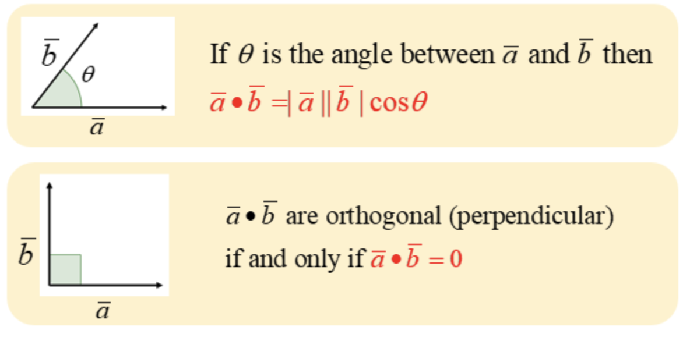

# Module 1: RAG Fundamentals & Setup

**Prerequisites**: Python basics, familiarity with APIs

---

## 1. Workshop Overview

### What We're Building

A RAG-powered assistant that generates accurate SciPy code using up-to-date documentation.

### Why This Matters: The Three LLM Limitations

| Problem              | Example                                                      | RAG Solution               |
| -------------------- | ------------------------------------------------------------ | -------------------------- |
| **Knowledge Cutoff** | Claude Fable 5 and Mythos 5's training ended in January 2026 | Retrieve current docs      |
| **Hallucinations**   | LLM confidently invents wrong answers                        | Ground in verified sources |
| **No Private Data**  | Can't access your codebase or internal docs                  | Index your own knowledge   |

**RAG solves all three problems.**

---

## 2. What is RAG?

**R**etrieval-**A**ugmented **G**eneration

A technique that enhances LLMs by giving them access to external knowledge at inference time.

```
User Query → Retrieve Relevant Docs → Augment Prompt → Generate Response
```

Instead of relying on training data alone, RAG:

1. **Retrieves** relevant documents from a knowledge base
2. **Augments** the prompt with retrieved context
3. **Generates** a grounded response

### Real-World RAG Use Cases

- **Code Assistants**: GitHub Copilot-style tools for your codebase
- **Documentation Q&A**: Query product docs, APIs, legal documents
- **Customer Support**: Chatbots grounded in support articles
- **Research Assistants**: Query scientific papers
- **Enterprise Search**: Find information across company knowledge

**Our Use Case**: SciPy code generation with current documentation

---

## 3. The RAG Pipeline

### Two Phases

**Phase 1: Indexing (Offline)**

```
Documents → Chunk → Embed → Store in Vector DB
```

**Phase 2: Query (Online)**

```
Query → Embed → Retrieve Similar → Augment Prompt → Generate
```

---

### Visual Architecture

```
┌─────────────────────────────────────────────────────────────┐
│                    INDEXING PHASE                           │
├─────────────────────────────────────────────────────────────┤
│                                                             │
│   📄 Documents  →  ✂️ Chunk  →  🔢 Embed  →  💾 Store        │
│   (SciPy docs)    (Split)     (Vectors)    (ChromaDB)       │
│                                                             │
└─────────────────────────────────────────────────────────────┘

┌─────────────────────────────────────────────────────────────┐
│                     QUERY PHASE                             │
├─────────────────────────────────────────────────────────────┤
│                                                             │
│   ❓ Query  →  🔢 Embed  →  🔍 Retrieve  →  📝 Generate      │
│   "How do I    (Vector)    (Find similar)   (LLM answer)    │
│    fit curve?"                                              │
│                                                             │
└─────────────────────────────────────────────────────────────┘
```

---

## 4. What Are Embeddings?

### Definition

**Embeddings** = Dense vector representations of text that capture semantic meaning.

```python
"The cat sat on the mat"           → [0.12, -0.45, 0.78, ..., 0.23]
"A feline rested on a rug"         → [0.11, -0.43, 0.76, ..., 0.25]  # Similar!
"Python is a programming language" → [-0.32, 0.67, -0.12, ..., 0.89]  # Different!
```

**Key Insight**: Similar texts have similar vectors (close in vector space)

### Why Embeddings Matter for RAG

1. **Semantic Search**: Find relevant docs even without exact keyword matches
2. **Efficiency**: Compare documents quickly with vector math
3. **Language Understanding**: Capture meaning, not just words

---

### Embedding Models Comparison

| Model                  | Dimensions | Provider       | Cost            |
| ---------------------- | ---------- | -------------- | --------------- |
| text-embedding-3-small | 1536       | OpenAI         | $0.02/1M tokens |
| text-embedding-3-large | 3072       | OpenAI         | $0.13/1M tokens |
| nomic-embed-text       | 768        | Ollama (local) | Free            |
| mxbai-embed-large      | 1024       | Ollama (local) | Free            |

---

### Generating Embeddings

**With OpenAI:**

```python
from openai import OpenAI

client = OpenAI()
response = client.embeddings.create(
    input="scipy.optimize.minimize finds the minimum of a function",
    model="text-embedding-3-small"
)
embedding = response.data[0].embedding  # List of 1536 floats
```

**With Ollama (local):**

```python
import ollama

response = ollama.embeddings(
    model="nomic-embed-text",
    prompt="scipy.optimize.minimize finds the minimum of a function"
)
embedding = response['embedding']  # List of 768 floats
```

---

## 5. Similarity Search & Cosine Similarity

### What is Cosine Similarity?

Cosine similarity measures the **angle** between two vectors:

- **1.0** = Identical direction (very similar)
- **0.0** = Perpendicular (unrelated)
- **-1.0** = Opposite (very different)

### The Math

$$\text{cosine\_similarity}(\vec{A}, \vec{B}) = \frac{\vec{A} \cdot \vec{B}}{||\vec{A}|| \times ||\vec{B}||}$$

Where:

- $\vec{A} \cdot \vec{B}$ is the dot product
- $||\vec{A}||$ is the magnitude (length) of vector A

---

If $\vec{A} = \langle A_1, A_2, A_3, \dots, A_n \rangle,\ \vec{B} = \langle B_1, B_2, B_3, \dots, B_n \rangle$
Then the dot product is $\ \vec{A} \cdot \vec{B} = A_1B_1 + A_2B_2 + A_3B_3 + \dots + A_nB_n$

$\|\vec{A}\|_2 \times \|\vec{B}\|_2 = \sqrt{A_1^2 + A_2^2 + A_3^2} \times \sqrt{B_1^2 + B_2^2 + B_3^2}$

---



---

### Python Implementation

```python
import numpy as np

def cosine_similarity(vec1, vec2):
    vec1, vec2 = np.array(vec1), np.array(vec2)
    dot_product = np.dot(vec1, vec2)
    magnitude_a = np.linalg.norm(vec1)
    magnitude_b = np.linalg.norm(vec2)
    return dot_product / (magnitude_a * magnitude_b)
```

### Toy Example 1: Simple 2D Vectors

```python
# Two similar vectors (pointing in similar directions)
vec_a = [1, 2]
vec_b = [2, 4]

# Calculate step by step
dot_product = 1*2 + 2*4  # = 10
magnitude_a = sqrt(1² + 2²)  # = sqrt(5) ≈ 2.24
magnitude_b = sqrt(2² + 4²)  # = sqrt(20) ≈ 4.47

cosine_sim = 10 / (2.24 * 4.47)  # ≈ 1.0 (identical direction!)
```

---

### Toy Example 2: Perpendicular Vectors

```python
# Perpendicular vectors (90 degrees apart)
vec_a = [1, 0]
vec_b = [0, 1]

dot_product = 1*0 + 0*1  # = 0
# Result: cosine_similarity = 0 (unrelated)
```

### Toy Example 3: Opposite Vectors

```python
# Opposite vectors (180 degrees apart)
vec_a = [1, 1]
vec_b = [-1, -1]

dot_product = 1*(-1) + 1*(-1)  # = -2
# Result: cosine_similarity = -1 (opposite)
```

---

### Exercise for Attendees

Calculate the cosine similarity for these pairs:

1. `[3, 4]` and `[6, 8]`
2. `[1, 0, 0]` and `[0, 1, 0]`
3. `[1, 1, 1]` and `[1, 1, 1]`

<details>
<summary>Answers</summary>

1. **1.0** — Same direction (one is a scalar multiple of the other)
2. **0.0** — Perpendicular (orthogonal basis vectors)
3. **1.0** — Identical vectors

</details>

---

## 6. Visualizing Embeddings with PCA

### What is PCA?

PCA (Principal Component Analysis) takes huge embedding vectors and flattens them down into 2D so we can plot them. Think of it like "squishing" a high-dimensional cloud of points onto a flat piece of paper, while trying to keep the most important patterns visible.

### Interpreting a PCA Plot

When you see an embedding visualization:

- **Blue points closer together** = Their embeddings are more similar
- **Points far apart** = Their embeddings are dissimilar

For example, `scipy.integrate` and `scipy.optimize` would probably have a higher cosine similarity than `scipy.integrate` and `"reading books"`.

---

### Important Caveat: Variance Explained

If your PCA plot shows "~41% of variance explained," this means:

- This 2D view preserves about **41%** of the structure/spread from the original high-dimensional embeddings
- The remaining **59%** is in the dimensions we compressed away
- The plot gives a **useful visual approximation**, but doesn't capture everything

### Key Insight

The **real** cosine similarity is computed on the original high-dimensional embeddings (1536 or 768 dimensions), not on the flattened 2D points. But visually, the PCA plot shows the same general idea: **related concepts cluster closer together, unrelated ones are farther apart**.

---

## 7. Vector Databases

### Why Not Traditional Databases?

Traditional databases are optimized for exact matches and structured queries.

**Vector databases** are optimized for:

- **Approximate Nearest Neighbor (ANN)** search
- **High-dimensional data** (1000+ dimensions)
- **Hybrid search** (vectors + metadata filters)

---

### Popular Options

| Database     | Description                       |
| ------------ | --------------------------------- |
| **ChromaDB** | Simple, local, great for learning |
| **Pinecone** | Cloud-hosted, production-ready    |
| **Qdrant**   | Open source, scalable             |
| **FAISS**    | Facebook's library, lightweight   |
| **Weaviate** | Open source, GraphQL interface    |

---

### ChromaDB Basics

```python
import chromadb
from chromadb.utils import embedding_functions

# Create client
client = chromadb.PersistentClient(path="./chroma_db")

# Set up embedding function
openai_ef = embedding_functions.OpenAIEmbeddingFunction(
    api_key=os.getenv("OPENAI_API_KEY"),
    model_name="text-embedding-3-small"
)

# Create collection
collection = client.create_collection(
    name="scipy_docs",
    embedding_function=openai_ef
)
```

---

### Adding Documents

```python
# Add documents with metadata
collection.add(
    ids=["doc1", "doc2", "doc3"],
    documents=[
        "scipy.optimize.minimize finds the minimum of a function",
        "scipy.integrate.quad computes definite integrals",
        "scipy.linalg.solve solves linear equations"
    ],
    metadatas=[
        {"module": "optimize", "function": "minimize"},
        {"module": "integrate", "function": "quad"},
        {"module": "linalg", "function": "solve"}
    ]
)
```

ChromaDB automatically embeds the documents!

---

### Querying

```python
# Semantic search
results = collection.query(
    query_texts=["How do I fit a curve to data?"],
    n_results=3
)

# With metadata filter
results = collection.query(
    query_texts=["optimization"],
    n_results=3,
    where={"module": "optimize"}
)

# Results contain:
# - documents: The matching texts
# - metadatas: Associated metadata
# - distances: How far from query (lower = more similar)
```

---

## 8. Approximate Nearest Neighbor (ANN) Search

### The Problem: Exact Search is Slow

With millions of documents, comparing your query to every single vector is computationally expensive:

```
Query vector → Compare to 1,000,000 vectors → O(n) time
```

### The Solution: Approximate Nearest Neighbors

Instead of checking every vector, ANN algorithms build intelligent index structures that let you "jump" to the right neighborhood quickly.

### HNSW: Hierarchical Navigable Small World

ChromaDB uses HNSW (Hierarchical Navigable Small World) for fast similarity search.

---

**How it works:**

1. **Builds a graph structure** where vectors are nodes
2. **Creates multiple layers**
3. **Search starts at top layer** (few nodes, big jumps)
4. **Descends to lower layers** (more nodes, fine-grained search)

### HNSW Configuration in ChromaDB

```python
collection = client.create_collection(
    name="scipy_docs",
    embedding_function=openai_ef,
    metadata={"hnsw:space": "cosine"}  # Distance metric
)
```

---

**`hnsw:space` options:**

| Option   | Description                        | Best For                  |
| -------- | ---------------------------------- | ------------------------- |
| `cosine` | Measures angle between vectors     | Text embeddings (default) |
| `l2`     | Euclidean distance (straight-line) | Image embeddings          |
| `ip`     | Inner product (dot product)        | Normalized embeddings     |

OpenAI embeddings are normalized, so `cosine` is the standard choice.

### Trade-offs: Exact vs Approximate

| Aspect   | Exact Search         | ANN (HNSW)             |
| -------- | -------------------- | ---------------------- |
| Accuracy | 100% correct         | ~95-99% (configurable) |
| Speed    | O(n) - slow at scale | O(log n) - fast        |
| Memory   | Just vectors         | Vectors + graph index  |
| Use Case | Small datasets       | Production scale       |

---

## 9. Hybrid Search (Dense + Sparse)

### The Problem with Pure Dense Search

Dense (embedding) search is great for semantic similarity but can miss exact keyword matches:

```
Query: "scipy.optimize.minimize"
Dense search might return: "optimization functions" (semantically similar)
But misses: exact documentation for minimize()
```

---

### Hybrid Search: Best of Both Worlds

Combine **dense** (embedding) search with **sparse** (keyword/BM25) search:

```python
class HybridRetriever:
    def __init__(self, vector_store, documents, alpha=0.5):
        self.vector_store = vector_store  # Dense
        self.bm25 = SimpleBM25(documents)  # Sparse
        self.alpha = alpha  # Weight for dense (0-1)

    def search(self, query: str):
        # Dense retrieval (semantic)
        dense_results = self.vector_store.search(query)

        # Sparse retrieval (keyword)
        sparse_results = self.bm25.search(query)

        # Combine scores
        # hybrid_score = alpha * dense + (1 - alpha) * sparse
        return combined_results
```

---

Keyword search is good at exact matches:

> “Find documents that contain this specific term, acronym, product name, ID, or phrase.”

While semantic search is good at meaning:

> “Find documents that are conceptually related, even if they use different words.”

### When to Use Hybrid Search

| Scenario                             | Recommendation           |
| ------------------------------------ | ------------------------ |
| Queries include exact function names | Hybrid (alpha=0.5)       |
| Natural language questions only      | Dense only (alpha=1)     |
| Searching code/identifiers           | Sparse heavy (alpha=0.3) |

---

## 10. Building a Mini RAG System

### Putting It All Together

```python
def simple_rag(query: str) -> str:
    # 1. Retrieve relevant documents
    results = collection.query(query_texts=[query], n_results=3)

    # 2. Build context from retrieved docs
    context = "\n\n".join(results['documents'][0])

    # 3. Create augmented prompt
    prompt = f"""Context:
{context}

Question: {query}

Answer based on the context above."""

    # 4. Generate response
    response = openai.chat.completions.create(
        model="gpt-4o-mini",
        messages=[{"role": "user", "content": prompt}]
    )
    return response.choices[0].message.content
```

**That's RAG in 15 lines!**

---

## 11. The Embedding Mismatch Problem

### Critical Rule

**Always use the same embedding model for indexing and querying.**

### What Happens When Models Don't Match

```
Indexing (stored documents):
"scipy.optimize.minimize..." → Embedding Model A → [0.12, -0.34, ...] (1536 floats)
                                                         ↓
                                                  ChromaDB stores this vector

Querying (searching):
"How do I minimize a function?" → Embedding Model B → [0.08, -0.29, ...] (768 floats)
                                                         ↓
                                                  ❌ Can't compare!
```

---

### Why It Fails

```
Stored vectors:    [0.12, -0.34, 0.56, ...384 values]
Query vector:      [0.08, -0.29, 0.61, ...1536 values]
                          ↓
        Can't compute similarity - different sizes!
```

It's like trying to compare GPS coordinates (lat, long) with 3D coordinates (x, y, z).

### Practical Implication

If you build your ChromaDB with OpenAI embeddings (1536 dims) and try to query with Ollama nomic-embed-text (768 dims), you'll get an error. You'd need to **rebuild** the entire index with the new embedding model.

---

### What is Chunking

Chunking means splitting a large document into smaller pieces before putting it into a RAG system.

Instead of embedding one huge document as a single vector, we split it into chunks like:

```
📄 Document
  → Chunk 1
  → Chunk 2
  → Chunk 3
  → Chunk 4
```

Then each chunk gets its own embedding:

```
Chunk 1 → embedding vector
Chunk 2 → embedding vector
Chunk 3 → embedding vector
```

In RAG, this matters because the user’s query is usually about a specific part of a document, not the entire document.

---

Example

```
Document: Employee Handbook

Chunk 1: PTO policy
Chunk 2: Health benefits
Chunk 3: Expense reimbursement
Chunk 4: Security policy
```

Query:

```
"How many vacation days do employees get?"
```

**The system should retrieve the PTO policy chunk, not the entire handbook.**

---

### What is an LLM Reranker?

An LLM reranker is a second-pass ranking step in a RAG pipeline.

First, the inital retrieval finds a set of candidate chunks:

```
User query → embedding search / hybrid search → top 20 candidate chunks
```

Then the reranker looks at those candidates more carefully and reorders them:

```
query + candidate chunks → reranker → best 5 chunks
```

---

# What is Hit@k?

Hit@k is a retrieval evaluation metric. It measures whether retrieval found at least one relevant chunk in the top k results. It does not care exactly where the chunk appears within the top k.

```
Hit@k = 1 if a relevant item is in the top k results
Hit@k = 0 if no relevant item is in the top k results
```

Example:

```
Query: "How do I fit a curve to my data?"
Correct chunk: scipy_optimize_curve_fit::chunk0

Top 3 retrieved chunks:
1. scipy_optimize_minimize::chunk0
2. scipy_stats_norm::chunk0
3. scipy_optimize_curve_fit::chunk0
```

**Hit@3 = 1** because the correct chunk is in the top 3 results.

Hit@k is useful because the generator can only use chunks that were retrieved. If the right chunk is not in the top k, the LLM may not have the evidence it needs.

---

## Module 1 Summary

### Key Concepts Covered

| Concept               | What You Learned                             |
| --------------------- | -------------------------------------------- |
| **RAG Architecture**  | Retrieve → Augment → Generate                |
| **Embeddings**        | Dense vectors capturing semantic meaning     |
| **Cosine Similarity** | Measuring angle between vectors (0 to 1)     |
| **PCA Visualization** | 2D approximation of high-dimensional space   |
| **Vector Databases**  | Optimized for similarity search (ChromaDB)   |
| **ANN/HNSW**          | Fast approximate search via graph structures |
| **Hybrid Search**     | Combining semantic + keyword search          |

---

### What We Built

- Embedding generation (OpenAI + Ollama)
- ChromaDB collection with sample data
- Mini RAG system

---

## Exercises

### Exercise 1: Calculate Cosine Similarity

Given vectors `A = [1, 2, 3]` and `B = [4, 5, 6]`, calculate the cosine similarity by hand.

### Exercise 2: Build a ChromaDB Collection

Create a collection with 5 sample SciPy function descriptions and query it.

### Exercise 3: Compare Embedding Models

Generate embeddings for the same text using OpenAI, Ollama, or Claude. Compare the dimensions and try to understand why you can't mix them.

---

## Quick Reference

### ChromaDB Cheatsheet

```python
# Create client
client = chromadb.PersistentClient(path="./db")

# Create collection
collection = client.create_collection("name", embedding_function=ef)

# Add documents
collection.add(ids=[], documents=[], metadatas=[])

# Query
results = collection.query(query_texts=[], n_results=5, where={})

# Get by ID
results = collection.get(ids=[])

# Delete
collection.delete(ids=[])

# Count
collection.count()
```

---

### Cosine Similarity Formula

```python
def cosine_similarity(a, b):
    return np.dot(a, b) / (np.linalg.norm(a) * np.linalg.norm(b))
```

### Basic RAG Query

```python
results = collection.query(query_texts=[question], n_results=3)
context = "\n".join(results['documents'][0])
response = llm.generate(f"Context: {context}\n\nQuestion: {question}")
```
